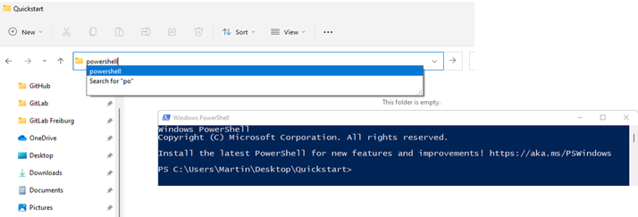
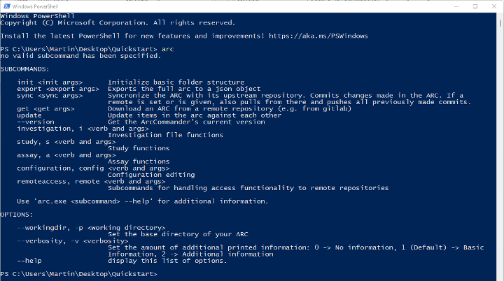
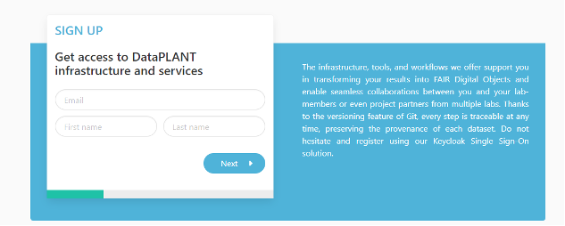
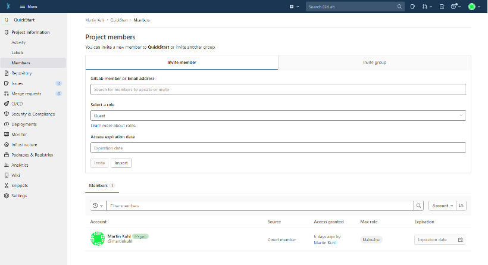

# DataPLANT’s QuickStart on ARCs
> V1.1, 2022

We are very happy that you chose our tools and infrastructure to create
and share your own ARCs. In this QuickStart we focus on how to use the
ARC Commander and SWATE to store your data and enrich it with metadata.

This document is work in progress: If you experience any
inconsistencies, have questions or would like to suggest additions to
it, please feel free to send a message to: info@nfdi4plants.org.

- [Setup and environment](#setup-and-environment)
  - [Required softwares](#required-softwares)
  - [The terminal](#the-terminal)
- [ARC initialization](#arc-initialization)
- [Adding metadata](#adding-metadata)
  - [ISA investigation](#isa-investigation)
  - [Adding ISA studies and assays](#adding-isa-studies-and-assays)
- [Sharing your ARC](#sharing-your-arc)
  - [DataPLANT registration and access](#dataplant-registration-and-access)
  - [ARC synchronization](#arc-synchronization)
  - [Invite collaborators](#invite-collaborators)
- [Data annotation](#data-annotation)

## Setup and environment

### Required softwares

- [ ] Please download the newest version for your operating system [here](https://github.com/nfdi4plants/arcCommander/releases) and install it according to [these instructions](https://github.com/nfdi4plants/arcCommander#install-and-start).
- [ ] Prerequisites for using the ARC Commander are [git](https://git-scm.com/downloads) and [git LFS](https://git-lfs.github.com/)

### The terminal

Most of this quickstart (especially the section [ARC initialization](#arc-initialization)) is based on the command line (Windows: cmd, powershell; Linux and Mac: terminal). The following picture shows exemplary how to open a powershell on windows in the designated ARC folder by entering *powershell* into the explorer path: .

- [ ] Text formatted `like this` represents commands to copy/paste into the
command line.

## ARC initialization

1. Head over to your local folder in which you want to initialize an ARC.

1. To test if the ARC Commander is functional, run the command `arc`,
    displaying a list of options:  
    

1. Initialize your ARC by executing the command `arc init`. This will
    create the general ARC folder structure:   
    

## Adding metadata

### ISA investigation

The ISA investigation workbook allows you to record administrative metadata of your project. The command `arc i create -i <your_investigation_identifier>` adds the isa.investigation.xlsx workbook including an identifier to your ARC.

    ```bash
    arc i create -i “quickStart_investigation”
    ```

### Adding ISA studies and assays

The ISA study and ISA assay workbooks allow you to annotate your experimental data. 

#### ISA study

#### ISA assay

Use the command `arc a add -a ` to add the isa.study.xlsx and isa.assay.xlsx. Again, a text editor will open. Here you need to enter an
    identifier for your ISA study, e.g. “QuickStartStudy”, and an
    identifier for your ISA assay, e.g. “QuickStartAssay”. 
    
    After you
    closed and saved the input, the ARC Commander will add
    subdirectories to the *studies* and *assays* folder. Your ARC should
    look similar to this now: 

1. Step number 4 can be repeated to add as many assays as needed.
    Accordingly, more subdirectories in addition to “QuickStartAssay”
    will be added. Multiple assays can be grouped in a study when the
    same StudyIdentifier in the text editor window is used. Place the
    data for each assay in the respective dataset folder.

## Sharing your ARC

### DataPLANT registration and access

> In case you are not a member of DataPLANT yet, please visit
<https://register.nfdi4plants.org> to register. Afterwards, you will be
granted access to DataPLANT’s DataHUB, available under
<https://git.nfdi4plants.org>, to share your ARCs with lab or project
partners. .

1. After successful registration, please visit the
    [DataHUB](https://git.nfdi4plants.org) to set an access token for
    ARC Commander synchronization.

    1. Sign-in in the top right corner. Click on your profile picture
     in the top right corner and go to *Preferences -\> Access
     Tokens.*

    1. Create an api access token with a name of your choice. These
     tokens grant read and write access to all of your groups and
     projects. Make sure you save your access token upon successful
     creation, as this is the only time you will have access to the
     token (in case you lose the token, you can simply create a new
     one).

> 

### ARC synchronization

1. Open the ARC Commander within your ARC as described above.
    Synchronize your ARC with the DataHUB using the command `arc
    sync`. The ARC Commander will ask for your credentials, where you
    need to enter your DataHUB handle (displayed on the DataHUB when
    clicking on your profile picture) and the newly generated access
    token.

    1. If you did not connect your local ARC with a remote one so far,
        you can specify the remote address with the flag -r in
        combination with a URL, e.g.,  
        `arc sync -r
        https://git.nfdi4plants.org/martinkuhl/QuickStart`  
        

    1. In case you want to create a new remote repository at this
        URL, it needs to be assembled like the following example:  
        <https://git.nfdi4plants.org/>*YourUserName*/*NameOfLocalFolder*

        If no repository exists under the given URL, the ARC Commander
        will produce an error ensuring that you spelled the URL
        correctly**.** Use `arc sync -f` to force synchronization to
        the specified URL. 

> Note: In case you did not set your git user name and email
    address you might get a warning to do so. These are needed for
    displaying them on the git commits. You can update the settings with
    the following commands:
    `git config --global user.name <your_name>`  
    `git config --global user.email <your_email>`

1. Check if the upload was successful by visiting the respective URL.

### Invite collaborators

1. You can invite lab-colleagues or project partners to join your ARC
    for collaborative work. While inside your ARC on the DataHUB, click
    on *Project information -\> Members* in the left navigation panel.
    Search for registered researchers and select a role for each
    individually. These roles come along with different rights. In
    short:  
    *Guest:* Have the least rights. Advised to use this for people you
    are asking for consultancy. *Developer:* The choice for most people
    you want to invite to your ARC. Developers have read and write
    access, but cannot maintain the project on the DataHUB, e.g.
    inviting others.  
    *Maintainer:* Gives the person the same rights as you have (except
    of removing you from your own project). This is recommended for
    inviting PIs or group leaders allowing them to add their group
    members for data upload or analysis to the project as well.  
    

> Note: A detailed usage instruction for the ARC Commander can be found
> [here](https://github.com/nfdi4plants/arcCommander/wiki/Detailed-usage-instruction).

## Data annotation

1. Your ARC should now contain one isa.investigation.xlsx and one or
    more isa.study.xlsx and isa.assay.xlsx file(s), respectively. Use
    the isa.study.xlsx to describe the characteristics of your samples,
    e.g. how you grew your plant, and isa.assay.xlsx to annotate
    experimental analyses. DataPLANT provides the Excel Add-In SWATE to
    support you in the annotation. Download and install the newest SWATE
    version according to [these
    instructions](https://github.com/nfdi4plants/Swate/wiki/docs01-installing-Swate#desktop-installation).
    In case you are using an older Excel version than Excel 2019, please
    install [SWATE for Excel
    online](https://github.com/nfdi4plants/Swate/wiki/docs01-installing-Swate#quickstart).

2. Use the *create annotation table* button in the yellow pop-up box
    (this only appears if you start SWATE on an Excel worksheet without
    an existing annotation table). An annotation table with the building
    blocks *Source Name* and *Sample Name* will be generated.  
    

3. Annotate your table with help of the [annotation
    principles](https://nfdi4plants.github.io/AnnotationPrinciples/). In
    short, *Characteristics* are used for study descriptions and
    describe inherent properties of the source material (e.g. a certain
    strain). *Parameters* describe steps in your experimental workflow
    (e.g. an instrument model or a growth chamber), and *Factors*
    describe independent variables that result in a specific output
    (e.g. the light intensity).

    1. The combination of ISA (Characteristics, Parameter, Factor) and
        a biological or technological ontology (e.g. temperature,
        strain, instrument model) gives the flexibility to display an
        ontology term, e.g. temperature, as a regular process parameter
        or as the factor your study is based on (Parameter
        \[temperature\] or Factor \[temperature\]).

4. Customize your table by adding building blocks:

    2. Choose the type of building block you want to add (A).

    3. If you chose a descriptive building block type (building blocks
        besides Sample Name, Source Name, and Data File Name), use
        search field (B) to search for an Ontology Term. SWATE accesses
        the SwateDB with a list of established external ontologies
        designated suitable for use in plant science. In addition, we
        feature our own ontology NFDI4PSO to extend the DB with missing,
        but necessary terms.

    4. If you want to add a building block with a unit, check box (C)
        and use search field (D) to look for a fitting unit term, e.g.
        degree Celsius as unit for Parameter \[temperature\].

    5. If you could not find a fitting term, you can use the Advanced
        Term Search with the blue links above the *Add building block*
        button. If you still could not find a fitting term, use free
        text input.  
        

    6. For more information on customizing your annotation table click
        [here](https://github.com/nfdi4plants/Swate/wiki/Docs03-Building-Blocks).

5. Alternatively, you can also use one of DataPLANT’s [SWATE
    templates](https://github.com/nfdi4plants/Swate/wiki/Docs05-Templates).
    You can find them under the *Protocol Insert* tab in SWATE.  
    

6. Fill the cells beneath each building block with ontology terms to
    note the respective *Characteristics, Parameter,* and *Factor*
    values of your experiment. Using the ontology term search function,
    you can fill multiple cells at once.

    7. When *Use related term directed search* (A) is enabled, SWATE
        will suggest a selection of suitable terms within the ontology
        for the column header, e.g. *TripleTOF* *5600* for *instrument
        model.*

    8. When term directed search (A) is disabled, SWATE will still
        suggest ontology terms, but without relation to the column
        header.

    9. If you could not find a fitting term, use free text input.

>  

*More information on how to use SWATE can be found
[here](https://github.com/nfdi4plants/Swate/wiki/Docs05-Templates).*

**In case you need further assistance also visit our
[Helpdesk](https://support.nfdi4plants.org).**
